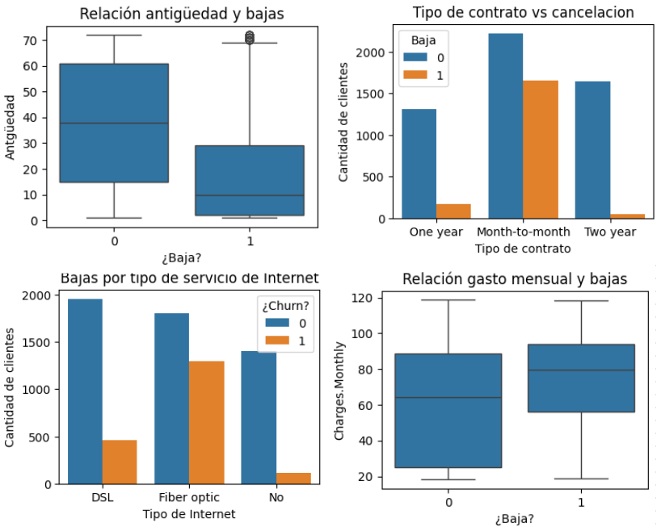

🔹 Introducción: El ojbetivo de este análisis es descubrir qué factores influyen en la pérdida de clientes para poder evitarla.

🔹 Limpieza y Tratamiento de Datos: Los datos fueron descargados en bruto desde la base de datos y fueron corregidos y depurados para poder trabajar con ellos.

🔹 Análisis Exploratorio de Datos

Ver gráficos-- > 

🔹 Conclusión:

Los clientes que más se dieron de baja son clientes con menos antiguedad. Esto da la pauta de que hayq ue intentar trabajar en la fidelización de los clientes

También influye en forma significativa el tipo de contrato. Los clientes con contrato mensuales son más propensos a darse de baja. Para evitarlo se podrían ofrecer más incentivos o descuentos para que elijan contratos más largos.

Dentro de los clientes con servivio de intrnet, la mayor cantidad de bajas se da en los que tienen servicio de fibra óptica. Recomiendo que se revise la calidad del servicio y comparar precios con la competencia.

Por último, los clientes que mayores gastos mensuales registran, son los que más tienen a darse de baja. Sugiero comparar precios para mantenerse competitivos en el mercado.